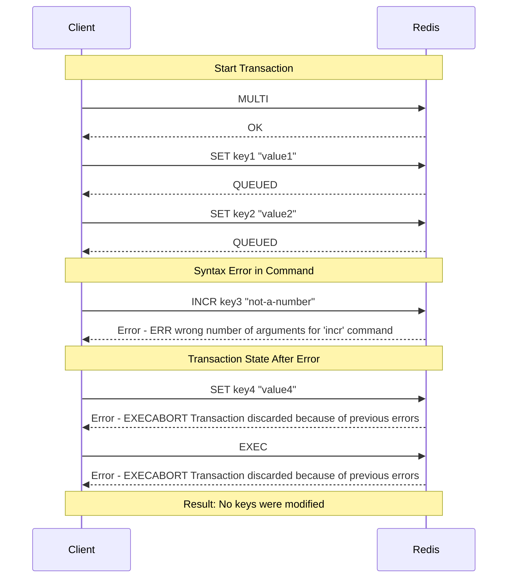
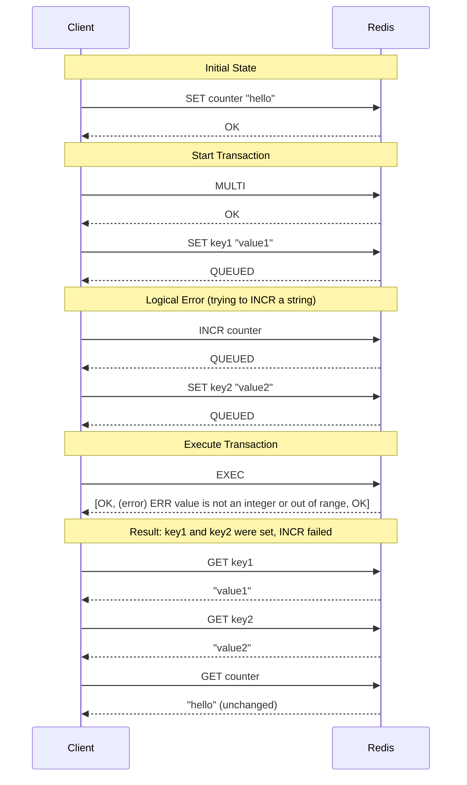
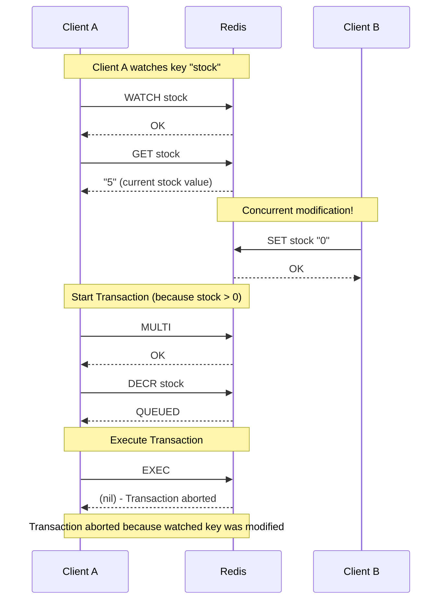

# Redis Transaction Demo

This project demonstrates the use of Redis transactions with a React frontend and a Gin backend. Users can interact with a simple UI to perform various Redis operations and see the results.

## Project Structure

- **Frontend:** ReactJS application for the user interface.
- **Backend:** Gin server handling API requests and interacting with Redis.

## Prerequisites

- Node.js and npm
- Go (Golang)
- Redis server

## Setup Instructions

### Backend (Gin Server)

1. **Navigate to the backend directory:**

   ```bash
   cd backend
   ```

2. **Initialize the Go module and install dependencies:**

   ```bash
   go mod init github.com/yourusername/redis-demo/backend
   go get -u github.com/gin-gonic/gin
   go get -u github.com/go-redis/redis/v8
   ```

3. **Run the Gin server:**

   ```bash
   go run main.go
   ```

### Frontend (ReactJS)

1. **Navigate to the frontend directory:**

   ```bash
   cd frontend
   ```

2. **Install dependencies:**

   ```bash
   npm install
   ```

3. **Start the React app:**

   ```bash
   npm start
   ```

### Redis Server

Ensure that your Redis server is running. You can start it with:

```bash
redis-server
```

## Usage

1. **Open the React app in your browser:**

   Navigate to `http://localhost:3000` to access the UI.

2. **Interact with the UI:**

3. **Check the Response:**

   The response from the backend will be displayed below the buttons, showing the result of the transaction.

## Redis Transaction Principles

Redis is single-threaded and all commands in a transaction are executed sequentially. This guarantees that the commands are executed as a single isolated operation.

```bash
From the Redis documentation:

All the commands in a transaction are serialized and executed sequentially. A request sent by another client will never be served in the middle of the execution of a Redis Transaction. This guarantees that the commands are executed as a single isolated operation.
```

Redis transactions are atomic, with no rollback in case of error:

```bash
From the Redis documentation:

Redis does not support rollbacks of transactions since supporting rollbacks would have a significant impact on the simplicity and performance of Redis.
```

## Redis Transaction Cases

This demo explores several cases to show how transactions work in Redis:

### Case 1: Syntax Error in Transaction

If any operation has a syntax error, the transaction will be aborted and none of the operations will be executed.



### Case 2: Logical Error in Transaction

If any operation has an error in the logic, the transaction will still execute and all other operations will be executed.



### Case 3: Watch and Optimistic Locking

Using the WATCH command to implement optimistic locking. If a watched key is modified by another client, the transaction will be aborted.



## Project Details

I've implemented these transaction cases in the backend code, with endpoints to demonstrate each case:

- `/txpipeline` - Shows a Redis WATCH transaction with concurrent modification (Case 3)
- `/syntax-error` - Demonstrates Case 1 (syntax error aborts the entire transaction)
- `/logic-error` - Demonstrates Case 2 (logical error allows other commands to execute)

You can access these endpoints via the API to see how Redis transactions behave in each scenario.

## License

This project is licensed under the MIT License.